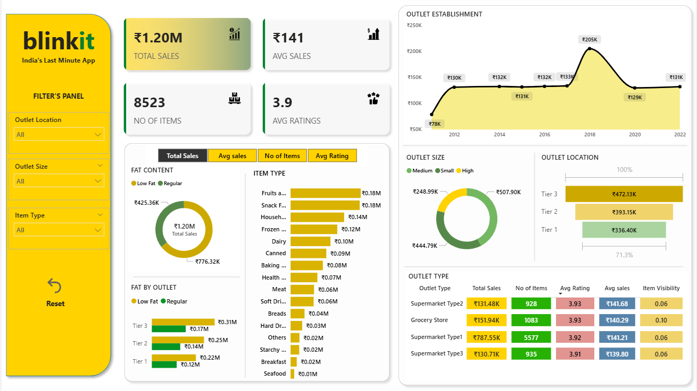
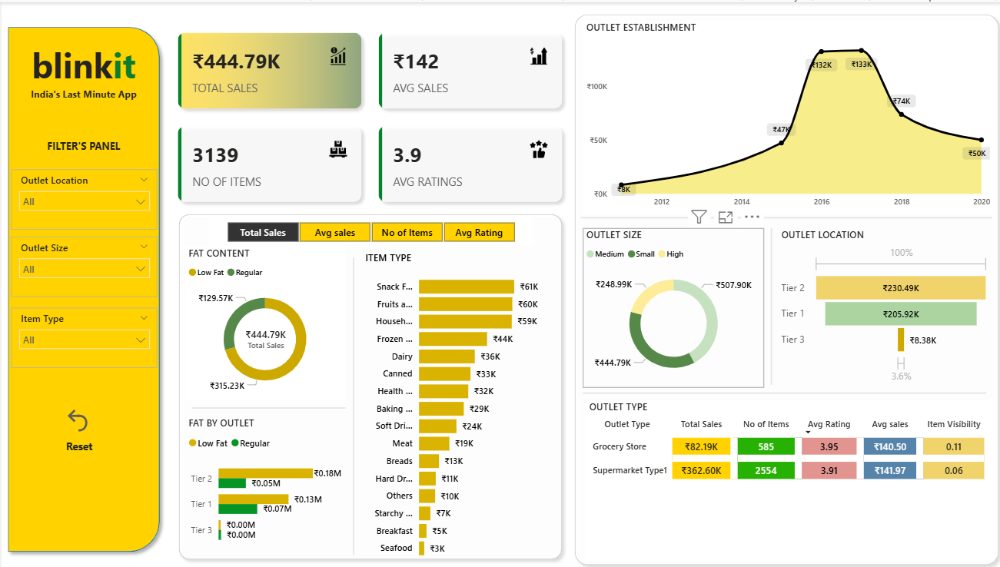

# 🛒 Blinkit Sales Analytics Dashboard - Power BI


> A comprehensive Power BI dashboard analyzing Blinkit's sales performance, customer satisfaction, and inventory distribution - built to surface actionable insights across outlets, product types, and geographies.

---

## 📌 Project Overview

This project delivers an end-to-end business intelligence solution for **Blinkit** (India's last-minute grocery delivery app), transforming raw sales data into interactive visualizations that help stakeholders monitor KPIs, identify performance gaps, and optimize operations.

---

## 🎯 Business Requirement

To conduct a comprehensive analysis of Blinkit's:
- **Sales Performance** - tracking revenue across products and outlets
- **Customer Satisfaction** - measuring average ratings by item and outlet
- **Inventory Distribution** - understanding item spread across store types and tiers

---

## 📊 KPIs Tracked

| KPI | Description |
|-----|-------------|
| 💰 **Total Sales** | Overall revenue generated from all items sold |
| 📈 **Average Sales** | Average revenue per sale transaction |
| 📦 **Number of Items** | Total count of distinct items sold |
| ⭐ **Average Rating** | Mean customer rating across items sold |

---

## 📋 Dashboard Features

### Granular Analysis
1. **Total Sales by Fat Content** - Impact of fat content (Low Fat vs Regular) on sales, with secondary KPI breakdown
2. **Total Sales by Item Type** - Performance of each product category in revenue terms
3. **Fat Content by Outlet for Total Sales** - Cross-outlet comparison segmented by fat content
4. **Total Sales by Outlet Establishment** - How outlet age/type influences revenue trends

### Chart Visualizations
5. **% Sales by Outlet Size** - Correlation between outlet size (Small / Medium / Large) and total sales share
6. **Sales by Outlet Location** - Geographic distribution across Tier 1, 2, and 3 cities
7. **All Metrics by Outlet Type** - Comprehensive view of all 4 KPIs broken down by outlet type (Grocery Store, Supermarket Type 1/2/3)

---

## 🗂️ File Structure

```
blinkit-powerbi-dashboard/
│
├──  BlinkIT Grocery Data.xlsx       # Raw data source
│
├──  Blinkit_Dashboard.pbix          # Power BI dashboard file
│
├── 📁 Screenshots/
│   └── dashboard.png         # Dashboard preview image
│
└── README.md
```

---

## 🔍 Key Insights

- **Low Fat** items contribute a higher share of total sales compared to Regular fat content items
- **Supermarket Type 1** outlets generate the highest total sales volume among all outlet types
- **Tier 3** cities show competitive sales figures, indicating strong demand beyond metro areas
- Outlets established between **2015-2020** show peak sales performance
- **Medium-sized** outlets account for the largest percentage of overall sales

---

## 🛠️ Tools & Technologies

- **Power BI Desktop** - Dashboard design, DAX measures, interactive visuals
- **Microsoft Excel** - Raw dataset source

---

## 📷 Dashboard Preview

> 
> 
> 


---

## 🚀 How to Use

1. **Clone this repository**
   ```bash
   git clone https://github.com/your-username/blinkit-powerbi-dashboard.git
   ```

2. **Open the dataset** - Load `BlinkIT Grocery Data.xlsx` in Power BI Desktop if prompted to reconnect the data source

3. **Open the dashboard** - Launch `Blinkit_Dashboard.pbix` in Power BI Desktop

4. **Explore** - Use the slicers and filters to explore sales by outlet, fat content, item type, and location

---


⭐ *If you found this project helpful, consider giving it a star!*
